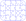

Inkscape-jigsaw
===============

An extension for Inkscape that creates jigsaw shaped pieces. Options for back, and single cut pieces.
Creates a jigsaw puzzle for laser cutting.
* set dimensions in various units,
* number of pieces in X,Y,
* randomness and size of tabs,
* rounded corners, and a backing as an option.
* packed neatly for minimal cutting.
* uses minimal lines to optimise for laser cutting (e.g. when using packed backboard).

May one day be extended to do boolean cuts and create separate pieces. (Will require DBUS  or some other way to call boolean ops from a plugin.)

Currently there is an experimental checkbox which will create pieces suitable for laborious manual boolean operations.

Useful if you want separate jigsaw pieces.

Usage
-----

Go to the Extensions menu > Render > Lasercut Jigsaw...
